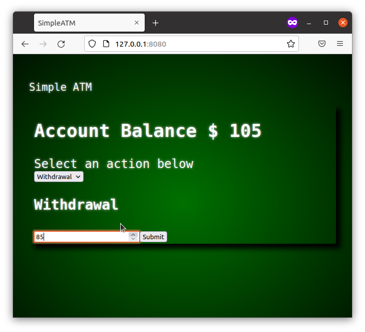

# SimpleATM
Simple ATM Repository for xPro course

Description: This is an exercise in using REACT to simulate the actions of a simple bank automatic teller machine (ATM) with the following features:
-Deposit money
-Withdraw money
-Validation to process positive numbers and prevent zero or negative balance.
All functions are within the browser and changes are not saved.

Usage: 
1. Download/copy the files and folders to a local folder. 
2. If using Node.js, open the command line point to the root folder of the target files, for example "cd path/to/SimpleATM". 
3. Then run "npm install" to install all dependencies, and then run "http-server ./public" to start the server. 
4. Then view the page by navigating to the following URL in a web browser: "http://127.0.0.1:8080/index.html" (default IP address and port number is shown). 

The output should include the following:
-A drop-down select menu with choices for deposit and withdrawal.
-A text box for entering a value with arrows to increase or decrease an integer value. 
-A button for updating the account balance.
The output should look like this:
 

Roadmap: This exercise can be improved in the future by adding features for better validation and to connect to a database. This could include a feature to allow access with the correct personal identification number (PIN) and to load any previous balance and to save the updated balance.

License: MIT License (NOTE: significant parts of this code was taught and/or provided via the MIT xPRO course in Full Stack Development, and I do not claim ownership over it)

Permission is hereby granted, free of charge, to any person obtaining a copy
of this software and associated documentation files (the "Software"), to deal
in the Software without restriction, including without limitation the rights
to use, copy, modify, merge, publish, distribute, sublicense, and/or sell
copies of the Software, and to permit persons to whom the Software is
furnished to do so, subject to the following conditions:

The above copyright notice and this permission notice shall be included in all
copies or substantial portions of the Software.

THE SOFTWARE IS PROVIDED "AS IS", WITHOUT WARRANTY OF ANY KIND, EXPRESS OR
IMPLIED, INCLUDING BUT NOT LIMITED TO THE WARRANTIES OF MERCHANTABILITY,
FITNESS FOR A PARTICULAR PURPOSE AND NONINFRINGEMENT. IN NO EVENT SHALL THE
AUTHORS OR COPYRIGHT HOLDERS BE LIABLE FOR ANY CLAIM, DAMAGES OR OTHER
LIABILITY, WHETHER IN AN ACTION OF CONTRACT, TORT OR OTHERWISE, ARISING FROM,
OUT OF OR IN CONNECTION WITH THE SOFTWARE OR THE USE OR OTHER DEALINGS IN THE
SOFTWARE.
